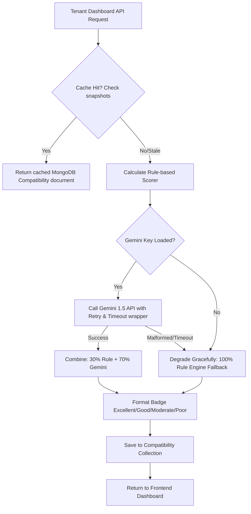

# Rent & Flatmate Finder 🏠✨

[](#)
[](LICENSE)
[](#)
[](#)

A production-quality MERN application where owners list rooms, tenants build preference profiles, and a robust dual-layer compatibility engine calculates matching insights. Features real-time conversation-scoped chat, templates for email notifications, and administrative platform controls.

---

## 📖 Table of Contents
1. [Tech Stack](#1-tech-stack)
2. [Folder Organization](#2-folder-organization)
3. [Setup & Environment Variables](#3-setup--environment-variables)
4. [AI Compatibility Architecture & Design](#4-ai-compatibility-architecture--design)
5. [Database ER Model](#5-database-er-model)
6. [API & Sockets Reference](#6-api--sockets-reference)
7. [Production Deployment Guidelines](#7-production-deployment-guidelines)
8. [License](#8-license)

---

## 1. Tech Stack

- **Backend:** Node.js (Express), MongoDB (Mongoose), Socket.IO, JWT Auth, Zod Validation, Morgan, Helmet, Rate Limiters
- **Frontend:** React (Vite), Context API, Axios, CSS Modules (premium aesthetics)
- **LLM:** Google Gemini (`gemini-1.5-flash`) via `@google/generative-ai`
- **Email Dispatch:** Nodemailer (standard SMTP integrations)

---

## 2. Folder Organization

```
Rent-Flatmate/
├── server/
│   ├── config/db.js            # MongoDB Connection pool
│   ├── models/                 # Database Schema definitions
│   │   ├── User.js             # Account roles (tenant, owner, admin)
│   │   ├── Listing.js          # Room ads
│   │   ├── TenantProfile.js    # Preference characteristics
│   │   ├── Compatibility.js    # Cached score metadata
│   │   ├── Conversation.js     # Thread scopes
│   │   └── Message.js          # Persisted private messages
│   ├── middleware/
│   │   ├── auth.js             # Protect & role verification
│   │   ├── errorHandler.js     # Centralized Exception Handler
│   │   └── validate.js         # Zod schemas request validations
│   ├── controllers/            # Route business logic handlers
│   ├── routes/                 # Express Router endpoint declarations
│   ├── services/               # Modular helpers
│   │   ├── geminiService.js         # LLM API & Prompt configuration
│   │   ├── ruleEngineService.js     # Fallback scoring mathematics
│   │   ├── compatibilityAggregator.js # Weight orchestrator (30% Rule, 70% Gemini)
│   │   ├── compatibilityCache.js    # Snapshot checker & caching database controller
│   │   └── emailService.js          # Dedicated html templates and nodemailer transport
│   ├── sockets/chatSocket.js   # Scoped socket channels
│   └── server.js               # Express app bootstrap
└── client/
    ├── src/
    │   ├── pages/              # Tenant, Owner, Admin, Login, Chat views
    │   ├── context/AuthContext.jsx # Global user authentication state
    │   ├── services/api.js     # Axios client configuration
    │   ├── index.css           # Premium global stylesheet
    │   └── App.jsx             # Main Router bootstrap
```

---

## 3. Setup & Environment Variables

### Prerequisites
- Node.js 18+ installed
- MongoDB (Local instance or Atlas cloud cluster)
- Gemini API Key ([AI Studio Key Page](https://aistudio.google.com/app/apikey))

### Configuration (`server/.env`)
Create a `.env` file inside `server/` with the following variables:
```env
PORT=5000
MONGO_URI=mongodb://127.0.0.1:27017/rent-flatmate
JWT_SECRET=super_secret_jwt_sign_key
GEMINI_API_KEY=your_gemini_api_key
GEMINI_MODEL=gemini-1.5-flash
HIGH_COMPATIBILITY_THRESHOLD=80
EMAIL_HOST=smtp.mailtrap.io
EMAIL_PORT=2525
EMAIL_USER=your_smtp_user
EMAIL_PASS=your_smtp_password
EMAIL_FROM="Rent & Flatmate Finder" <noreply@rentflatmate.com>
```

### Installation Commands
Run the following in your shell:

**Backend Setup:**
```bash
cd server
npm install

# Seed the database with Pune demo listings & tenant profiles
node seed.js

# Start the server
npm run dev
```

**Frontend Setup:**
```bash
cd client
npm install
npm run dev
```

### Database Seeding System
We include a powerful database seeding system in `server/seed.js`. Executing `node seed.js` does the following:
1. Clears existing collections.
2. Registers 4 Owner accounts and 8 Tenant accounts.
3. Publishes 15 Listing rooms across key Pune localities (Baner, Wakad, Hinjewadi, Kharadi, Viman Nagar, Pashan, Kothrud, Aundh) pre-populated with coordinates.
4. Creates 8 Tenant Profiles matching various rent budgets, localities, and preferences.
5. Displays login credentials for all demo accounts in the terminal.

---

## 4. AI Compatibility Architecture & Design

### Dual-Layer Matching System



### Prompt Specification
Gemini receives a structured context containing property location, rent, type, furnishing status, and description text matched against tenant preferences (including preferred room characteristics, parking, pets, smoking, gender, and notes). It returns a strict JSON payload:
```json
{
  "score": 92,
  "confidence": 0.95,
  "explanation": "Locality coordinates align, and the listing is pet friendly matching your preference.",
  "pros": ["Near preferred Baner West locality", "Pets allowed", "Fits budget comfortably"],
  "cons": ["No dedicated parking space listed"],
  "summary": "This listing matches almost all primary preferences and is highly recommended."
}
```

---

## 5. Database ER Model

```
   [User] 1 -------- 0..* [Listing] (published rooms)
     1                      1
     |                      |
     | 1                    | 0..*
     |                      |
[TenantProfile] 1 ------ 0..* [Compatibility] (caching score analytics)
     1                      1
     |                      |
     +------ 0..* [Conversation] 0..* ------+ (threads)
                      1
                      |
                      | 0..*
                  [Message] (conversation-scoped, read indicators)
```

---

## 6. API & Sockets Reference

### Major REST Paths
- **POST** `/api/auth/register` - Create user credentials.
- **POST** `/api/auth/login` - Verify password and returns token.
- **GET** `/api/listings` - Search active rooms. Filter by location, min/max rent, roomType, and furnishing. Returns paginated compatibility results.
- **POST** `/api/interest` - Submit interest request. Automatically notifies owner if score > 80.
- **PUT** `/api/interest/:id` - Accept/reject interest request. If accepted, initializes the user thread.
- **GET** `/api/messages/conversations` - Retrieve chat list for inbox.
- **GET** `/api/messages/conversation/:conversationId` - Retrieve paginated thread messages.

### WebSocket Handshakes
- Connect: `io(SOCKET_URL, { auth: { token } })`
- **Join Chat:** `socket.emit("join_chat", { conversationId })`
- **Send Message:** `socket.emit("send_message", { conversationId, message })`
- **Receive Broadcast:** Listen on `receive_message`.

---

## 7. Production Deployment Guidelines

1. **Persistent Connections:** Deploy to platforms supporting sticky WebSockets (e.g. Render, Railway, AWS ECS) instead of serverless architectures (Vercel/Netlify functions) to ensure active room subscriptions persist correctly.
2. **Database Sharding/Indexing:** Maintain default index rules. Ensure compound key unique constraints are mounted properly in the MongoDB cluster.
3. **Environment Caching:** Restrict Gemini API keys to production domains to secure token limits from spam.

---

## 8. License
Distributed under the MIT License. See `LICENSE` for details.
