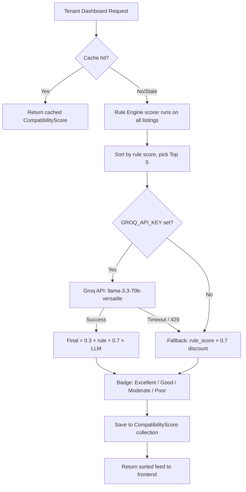

# Rent & Flatmate Finder 🏠✨

[](#)
[](LICENSE)
[](#)
[](#)

A production-quality MERN application where owners list rooms, tenants build preference profiles, and a robust dual-layer AI compatibility engine ranks matches. Features real-time conversation-scoped chat, HTML email notifications, and administrative platform controls.

---

## 📖 Table of Contents
1. [Tech Stack](#1-tech-stack)
2. [Folder Organization](#2-folder-organization)
3. [Setup & Environment Variables](#3-setup--environment-variables)
4. [AI Compatibility Architecture & Design](#4-ai-compatibility-architecture--design)
5. [Database Schema](#5-database-schema)
6. [API & Sockets Reference](#6-api--sockets-reference)
7. [LLM Prompt Specification](#7-llm-prompt-specification)
8. [Production Deployment Guidelines](#8-production-deployment-guidelines)
9. [License](#9-license)

---

## 1. Tech Stack

- **Backend:** Node.js (Express), MongoDB (Mongoose), Socket.IO, JWT Auth, Zod Validation, Morgan, Helmet, Rate Limiter
- **Frontend:** React (Vite), Context API, Axios, Framer Motion, Lucide React, CSS Custom Properties
- **LLM:** [Groq Cloud API](https://console.groq.com) using `llama-3.3-70b-versatile`
- **Email Dispatch:** Nodemailer (any SMTP provider — Mailtrap, Gmail, SendGrid, etc.)
- **Compatibility Engine:** Dual-layer — 30% rule-based score + 70% Groq LLM score, with graceful fallback

---

## 2. Folder Organization

```
Rent-Flatmate/
├── server/
│   ├── config/db.js               # MongoDB connection pool
│   ├── models/
│   │   ├── User.js                # Account roles (tenant, owner, admin)
│   │   ├── Listing.js             # Room listings with GeoJSON coordinates
│   │   ├── TenantProfile.js       # Tenant preferences (budget, location, lifestyle)
│   │   ├── CompatibilityScore.js  # Cached AI + rule score per tenant-listing pair
│   │   ├── Conversation.js        # Chat thread scopes
│   │   ├── Message.js             # Persisted chat messages
│   │   ├── Interest.js            # Interest request lifecycle
│   │   ├── Notification.js        # In-app notifications
│   │   ├── SavedListing.js        # Tenant bookmarks
│   │   ├── SearchHistory.js       # Tenant search audit log
│   │   ├── AuditLog.js            # Platform admin activity log
│   │   └── ListingImage.js        # Listing photo references
│   ├── middleware/
│   │   ├── auth.js                # JWT protect & role guard
│   │   ├── errorHandler.js        # Centralized exception handler
│   │   ├── validate.js            # Zod schema request validation
│   │   └── schemas.js             # Zod schemas
│   ├── controllers/               # Route business logic handlers
│   ├── routes/                    # Express Router endpoint declarations
│   ├── services/
│   │   ├── groqService.js         # Groq Llama-3 API client & prompt builder
│   │   ├── ruleEngineService.js   # Deterministic fallback scoring (geospatial + budget rules)
│   │   ├── compatibilityAggregator.js  # Top-N batch orchestrator (30% rule + 70% LLM)
│   │   ├── compatibilityCache.js  # Cache lookup & staleness checker
│   │   └── emailService.js        # HTML email templates & Nodemailer transport
│   ├── sockets/chatSocket.js      # Authenticated Socket.IO conversation rooms
│   ├── utils/
│   │   ├── asyncHandler.js        # Express async error wrapper
│   │   ├── geocoder.js            # Location → GeoJSON coordinate resolver
│   │   └── logger.js              # Winston structured logger
│   ├── seed.js                    # Database seeder (30 Pune listings, 15 tenant profiles)
│   └── server.js                  # Express app bootstrap
└── client/
    ├── src/
    │   ├── pages/                 # Landing, TenantDashboard, OwnerDashboard, Chat, Login, Register
    │   ├── components/
    │   │   ├── PropertyCard.jsx   # Airbnb-style listing card with AI score
    │   │   ├── MatchBreakdown.jsx # Expandable AI compatibility metrics
    │   │   └── ProtectedRoute.jsx # Auth-gated route wrapper
    │   ├── context/AuthContext.jsx # Global auth state
    │   ├── services/api.js        # Axios client with 401 auto-logout interceptor
    │   ├── index.css              # Design system (Emerald palette, glassmorphism)
    │   └── App.jsx                # Main router
```

---

## 3. Setup & Environment Variables

### Prerequisites
- Node.js 18+
- MongoDB (local instance or Atlas cloud cluster)
- [Groq API Key](https://console.groq.com) (free tier available)
- SMTP credentials for email (optional — emails are skipped gracefully if not set)

### Configuration (`server/.env`)

Create a `.env` file inside `server/` based on `.env.example`:

```env
PORT=5000
NODE_ENV=development
CLIENT_URL=http://localhost:5173

MONGO_URI=mongodb://127.0.0.1:27017/rent-flatmate-finder

JWT_SECRET=replace_with_a_long_random_string
JWT_EXPIRES_IN=7d

# Groq LLM (get free key at https://console.groq.com)
GROQ_API_KEY=your_groq_api_key_here
GROQ_MODEL=llama-3.3-70b-versatile

# Email (any SMTP — Mailtrap recommended for testing)
EMAIL_HOST=smtp.mailtrap.io
EMAIL_PORT=587
EMAIL_USER=your_mailtrap_user
EMAIL_PASS=your_mailtrap_pass
EMAIL_FROM="Rent & Flatmate Finder <no-reply@rentfinder.com>"

# Compatibility engine
HIGH_COMPATIBILITY_THRESHOLD=80
```

### Installation

**Backend:**
```bash
cd server
npm install

# Seed the database (30 Pune listings, 15 tenant profiles, precomputed AI scores)
node seed.js

# Start development server
npm run dev
```

**Frontend:**
```bash
cd client
npm install
npm run dev
```

**Demo credentials (after seeding):**
| Role | Email | Password |
|---|---|---|
| Tenant | `tenant1@example.com` | `password123` |
| Owner | `owner1@example.com` | `password123` |
| Admin | `admin@example.com` | `adminpassword123` |

---

## 4. AI Compatibility Architecture & Design

### Dual-Layer Matching System

The compatibility engine uses a **two-stage hybrid architecture** to balance speed, accuracy, and cost:

```
Stage 1 — Rule Engine (always runs, zero latency)
  └─ Scores all listings locally using deterministic rules:
       • Location distance bands (Haversine formula, max 30 pts)
       • Budget fit (max 30 pts)
       • Move-in date availability (max 10 pts)
       • Room type match (max 10 pts)
       • Furnishing match (max 10 pts)
       • Description keyword checks — parking, pets, smoking, gender (max 10 pts)

Stage 2 — Groq Llama-3 (Top-5 only, sequential with 250ms throttle)
  └─ Ranks the top 5 rule-scored listings by semantic analysis
  └─ Combines scores: final = (0.3 × rule_score) + (0.7 × llm_score)
  └─ Falls back to (rule_score × 0.7) if Groq is unavailable
       → Discount factor ensures AI-scored results always rank above fallbacks
```



### Caching
Scores are stored in the `CompatibilityScore` collection, keyed by `(tenantId, listingId)`. A score is considered stale and recomputed if:
- The listing's rent, room type, or availability date changes.
- The tenant's budget, preferred location, or move-in date changes.

---

## 5. Database Schema

### Collections & Relationships

```
[User]
  ├── role: "tenant" | "owner" | "admin"
  ├── 1 → 1   [TenantProfile]          (tenant preferences and map coordinates)
  ├── 1 → N   [Listing]                (owner's published rooms, society details, and coordinates)
  ├── 1 → N   [SavedListing]           (tenant bookmarks)
  └── 1 → N   [Review]                 (reviews left by tenants for owners)

[Listing]
  ├── locationCoords: GeoJSON Point     (2dsphere index for geospatial queries)
  ├── status: "available" | "filled"   (filled listings hidden from search)
  ├── societyName, area, city, state, pincode, landmark
  ├── 1 → N   [ListingImage]
  ├── 1 → N   [CompatibilityScore]     (one per tenant-listing pair)
  └── 1 → N   [Interest]               (tenant interest requests)

[Interest]
  ├── status: "pending" | "accepted" | "rejected"
  └── accepted → creates [Conversation] thread

[Conversation]
  └── 1 → N   [Message]                (Socket.IO persisted messages)

[CompatibilityScore]
  ├── generatedBy: "groq" | "rule-engine"
  ├── score, ruleScore, llmScore, confidence
  └── pros[], cons[], explanation, summary

[Review]
  ├── ownerId: Owner User Reference
  ├── tenantId: Tenant User Reference
  ├── rating: Number (1-5)
  └── reviewText: String (Max 1000 characters)
```

### Key Indexes
- `CompatibilityScore`: compound unique index on `(tenantId, listingId)`
- `Listing.locationCoords`: `2dsphere` index for geospatial queries
- `TenantProfile.locationCoords`: `2dsphere` index for geospatial preference calculations
- `Conversation`: compound unique index on `(listingId, tenantId, ownerId)`
- `Message`: index on `conversationId` for paginated thread fetching
- `Review`: compound unique index on `(ownerId, tenantId)` to prevent duplicate reviews per host
- `Interest`: compound unique index on `(tenantId, listingId)` to prevent duplicate requests
- `SavedListing`: compound unique index on `(tenantId, listingId)` to prevent duplicate bookmarks

---

## 6. API & Sockets Reference

### Auth
| Method | Endpoint | Description |
|---|---|---|
| POST | `/api/auth/register` | Register (tenant/owner) |
| POST | `/api/auth/login` | Login, returns JWT |

### Listings
| Method | Endpoint | Description |
|---|---|---|
| GET | `/api/listings` | Search active listings. Query params: `location`, `minRent`, `maxRent`, `roomType`, `furnishing`. Returns ranked compatibility scores for authenticated tenants. |
| POST | `/api/listings` | Create listing (owner only) |
| PATCH | `/api/listings/:id` | Update listing (owner only) |
| DELETE | `/api/listings/:id` | Delete listing (owner only) |
| PATCH | `/api/listings/:id/fill` | Mark listing as filled — removes from search results |

### Interest Requests
| Method | Endpoint | Description |
|---|---|---|
| POST | `/api/interest` | Tenant expresses interest. Triggers owner email if score > 80. |
| PUT | `/api/interest/:id` | Owner accepts/rejects. Acceptance creates chat thread + sends tenant email. |
| GET | `/api/interest/received` | Owner views all received requests |
| GET | `/api/interest/sent` | Tenant views their submitted requests |

### Messages & Chat
| Method | Endpoint | Description |
|---|---|---|
| GET | `/api/messages/conversations` | List all chat threads for current user |
| GET | `/api/messages/conversation/:id` | Fetch paginated messages for a thread |

### Saved Listings
| Method | Endpoint | Description |
|---|---|---|
| POST | `/api/saved/toggle` | Toggle bookmark on a listing |
| GET | `/api/saved` | Get tenant's saved listings |

### Admin
| Method | Endpoint | Description |
|---|---|---|
| GET | `/api/admin/users` | List all users |
| DELETE | `/api/admin/users/:id` | Delete user |
| GET | `/api/admin/listings` | View all listings |

### WebSocket Events (Socket.IO)
```js
// Connect with JWT
const socket = io("http://localhost:5000", { auth: { token: "your_jwt_token" } });

// Join a conversation room
socket.emit("join_chat", { conversationId: "..." });

// Send a message
socket.emit("send_message", { conversationId: "...", message: "Hello!" });

// Receive messages in real time
socket.on("receive_message", (msg) => console.log(msg));
```

---

## 7. LLM Prompt Specification

The Groq API receives a structured prompt containing listing and tenant details. It must return strict JSON — no markdown, no prose.

**Prompt template:**
```
Given this room listing:
- Location: Baner, Pune
- Rent: ₹12,000
- Room Type: single
- Furnishing: furnished
- Description: Quiet gated society, parking available, no pets.
- Available From: 01/08/2025

And this tenant profile:
- Preferred Location: Baner
- Budget Range: ₹8,000 - ₹14,000
- Desired Move-in Date: 01/08/2025
- Preferred Room Type: single
- Parking Required: Yes
- Pets Allowed Preference: No

Compute a compatibility score from 0 to 100. Return ONLY valid JSON:
```

**Example response:**
```json
{
  "score": 91,
  "confidence": 0.94,
  "explanation": "Listing is in the preferred Baner locality, fits within budget, and parking is available as required.",
  "pros": [
    "Rent fits within budget",
    "Parking available as required",
    "Preferred room type match",
    "Available on move-in date"
  ],
  "cons": [
    "No pets allowed — but tenant has no pet preference conflict"
  ],
  "summary": "This listing is an excellent match across all primary preferences and is highly recommended."
}
```

**Final score formula:**
```
final_score = round(0.3 × rule_score + 0.7 × llm_score)
```
If Groq is unavailable, `final_score = round(rule_score × 0.7)` — the 0.7 discount ensures AI-scored results always float above fallback results in rankings.

---

## 8. Production Deployment Guidelines

1. **WebSocket Hosting:** Deploy to platforms that support persistent connections — [Render](https://render.com), [Railway](https://railway.app), or [Fly.io](https://fly.io). Avoid pure serverless (Vercel/Netlify functions) as WebSocket rooms require sticky connections.
2. **MongoDB Atlas:** Use a cloud cluster with the connection string in `MONGO_URI`. Ensure indexes are created via `seed.js` or Mongoose's `autoIndex`.
3. **Groq Rate Limits:** The free tier allows ~30 RPM. The Top-5 sequential throttle architecture (250ms delay between calls) is designed to stay well within this limit.
4. **Email:** Configure any SMTP provider. [Mailtrap](https://mailtrap.io) (free) is recommended for testing. Gmail app passwords also work with `EMAIL_HOST=smtp.gmail.com`.

---

## 9. License
Distributed under the MIT License. See `LICENSE` for details.
