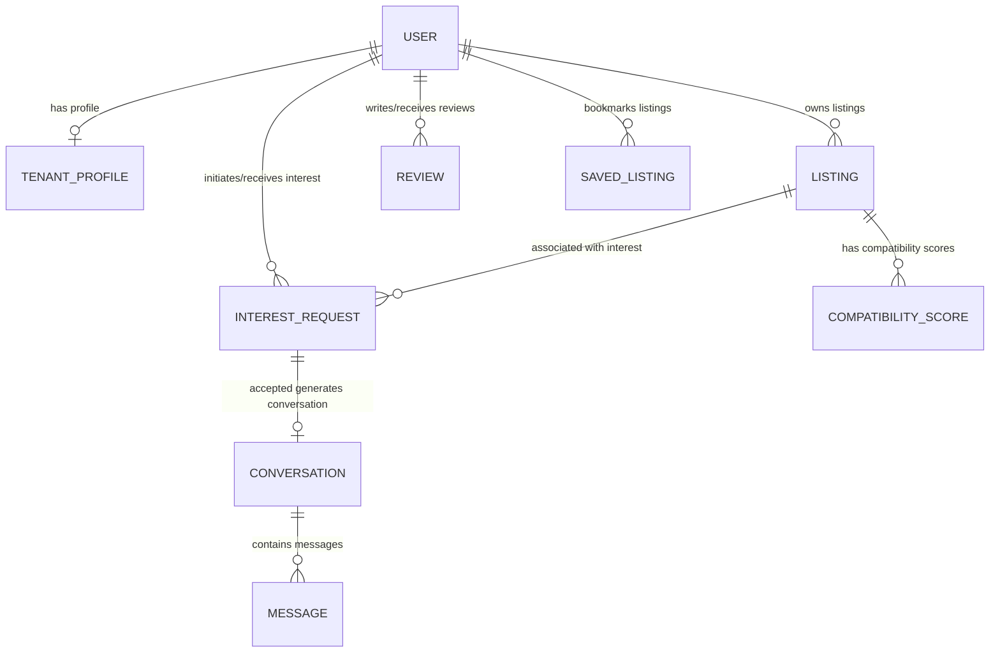
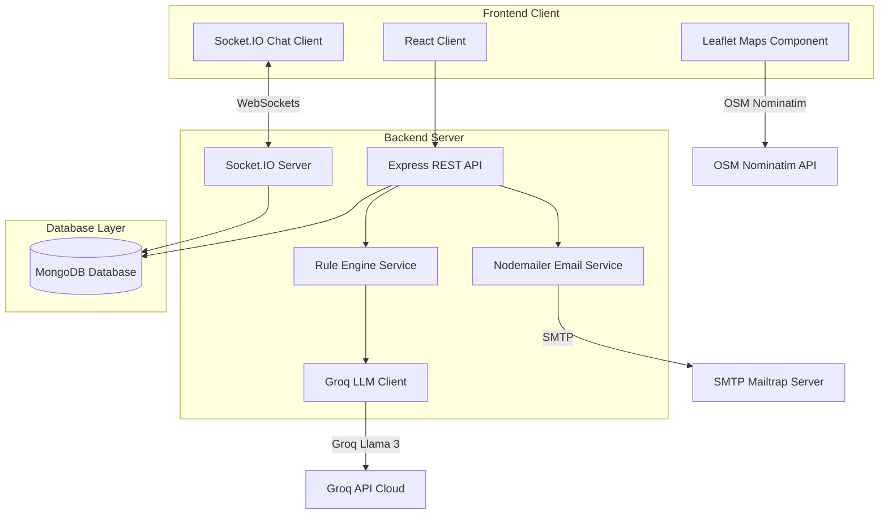

# System Design Write-up — Rent & Flatmate Finder 🏠🤖

This document provides a comprehensive overview of the architecture, data models, AI compatibility engine, chat systems, and notification workflows for the Rent & Flatmate Finder platform.

---

## 1. Hybrid Compatibility Scoring Design

The platform uses a **two-phase hybrid compatibility engine** designed to evaluate compatibility between a tenant’s match preferences and a listing’s characteristics. 

```
Stage 1: Rule Engine Scorer (Deterministic)
  └─ Evaluates 100% of candidate listings locally using high-performance maths.
  └─ Computes commute distance via the Haversine formula (max 30 pts).
  └─ Evaluates budget fit, move-in availability, room type, furnishing, and description keyword matches (parking, smoking, pets, gender) (max 70 pts).
  └─ Sorts listings in descending order to identify the Top-5 most relevant candidates.

Stage 2: LLM Engine Scorer (Groq Llama-3.3-70b)
  └─ Invokes Groq semantic analysis ONLY for the Top-5 listings to control API cost and rate limits.
  └─ Prompts Llama-3 with the listing specs, tenant preferences, and the exact computed distance in km.
  └─ Receives strict JSON output containing a score, confidence, pros/cons, and distance-aware match explanations.
```

### Distance-Aware Compatibility Calculations
Instead of doing exact string comparison for localities, Stage 1 uses real geographic coordinates. Given coordinates $(lat_1, lng_1)$ for the listing and $(lat_2, lng_2)$ for the tenant's preferred locality, Stage 1 calculates the physical distance $d$ in kilometers using the Haversine formula:

$$\Delta lat = lat_2 - lat_1$$
$$\Delta lng = lng_2 - lng_1$$
$$a = \sin^2\left(\frac{\Delta lat}{2}\right) + \cos(lat_1) \cdot \cos(lat_2) \cdot \sin^2\left(\frac{\Delta lng}{2}\right)$$
$$c = 2 \cdot \arctan2(\sqrt{a}, \sqrt{1-a})$$
$$d = R \cdot c \quad (\text{where } R = 6371 \text{ km})$$

Based on the computed distance $d$, location compatibility is graded into bands:
* $d \le 1.0\text{ km}$: 30 points (Excellent)
* $1.0\text{ km} < d \le 3.0\text{ km}$: 28 points (Good)
* $3.0\text{ km} < d \le 5.0\text{ km}$: 24 points (Moderate)
* $5.0\text{ km} < d \le 8.0\text{ km}$: 20 points (Fair)
* $8.0\text{ km} < d \le 12.0\text{ km}$: 15 points (Distanced)
* $12.0\text{ km} < d \le 20.0\text{ km}$: 8 points (Far)
* $d > 20.0\text{ km}$: 0 points (Out of range)

### Score Aggregation
For the Top-5 listings, the system computes an aggregated score:
$$\text{Score}_{\text{final}} = \text{round}\left(0.3 \cdot \text{Score}_{\text{rule}} + 0.7 \cdot \text{Score}_{\text{LLM}}\right)$$

### Performance Caching
To keep the application highly responsive and avoid redundant API requests, scores are cached in the `CompatibilityScore` collection. Cached scores carry an `inputSnapshot` of the Listing’s rent/location and the Tenant’s budget/location preferences. If a request is received and the inputs have not changed, the cache is hit immediately. Any change in either the listing or the tenant's profile invalidates the cache, prompting a recalculation.

---

## 2. LLM Integration and Fallback Mechanism

The `groqService.js` manages connections to the Groq Cloud API, targeting the `llama-3.3-70b-versatile` model. To ensure robustness, the integration implements a graceful fallback mechanism:
1. **Try Block**: The LLM client calls the API. The prompt demands strict JSON output without markdown backticks.
2. **Outage/Rate-Limit Catch**: If the Groq API times out, returns a rate-limit error (HTTP 429), or outputs malformed JSON, the aggregator catches the exception.
3. **Deterministic Fallback**: The aggregator falls back entirely to the Rule-Based score. A **discount factor of 0.7** is applied to fallback scores to ensure listings validated by the AI rank higher.
4. **Transparency**: The fallback score is saved in the database with the field `generatedBy: "rule-engine"` instead of `"groq"`, allowing administrators to audit system usage.

---

## 3. Access-Controlled Chat Architecture

Chat conversations are designed to prevent spam. Direct messaging is disabled by default. A tenant and landlord can chat only if the tenant has expressed interest in a listing and the landlord has clicked **Accept**.

* **Access Control Assertion**: Before rendering a chat window or retrieving message logs (`GET /api/messages/conversation/:id`), the backend verifies that an accepted `InterestRequest` exists linking the listing, tenant, and landlord. If not, the request returns HTTP 403.
* **WebSocket Handshake Authentication**: Socket.IO connections pass a JWT in `socket.handshake.auth.token`. The socket middleware decrypts this token using the unified JWT secret.
* **Message Durability**: When a message is sent via `send_message`, the server writes it to MongoDB (`Message.create`) before broadcasting it to the Socket.IO room. This ensures no message is displayed unless it is successfully persisted.

---

## 4. Notification Flow

The notification engine keeps users updated on interest requests and acceptances:
1. **Interest Request (`POST /api/interest`)**: If the compatibility score for a tenant-listing pair exceeds the `HIGH_COMPATIBILITY_THRESHOLD` (default 80), the system dispatches an email to the landlord indicating a high-compatibility match.
2. **Decision Made (`PUT /api/interest/:id`)**: When a landlord accepts or rejects the interest request, the backend dispatches an email notifying the tenant of the status update.
3. **Graceful Outage Isolation**: Nodemailer SMTP operations are isolated in individual try/catch statements. If the email server is offline, the transaction is logged as a warning, and the API request returns success, ensuring email outages do not block core platform functionality.

---

## 5. Database Schema & ER Diagram

The database utilizes Mongoose schemas built on MongoDB. The relationships are shown in the Entity-Relationship diagram below:



### Key Indexes for High Performance:
- **`2dsphere` Geospatial Indexes**: Configured on `Listing.locationCoords` and `TenantProfile.locationCoords` to optimize physical distance calculations and spatial query execution speeds.
- **Compound Unique Index on `Review`**: Enforces `{ ownerId: 1, tenantId: 1 }` to guarantee that a tenant can only submit a single review for a landlord.
- **Compound Unique Index on `SavedListing`**: Enforces `{ tenantId: 1, listingId: 1 }` to prevent duplicate bookmarks.
- **Compound Unique Index on `InterestRequest`**: Enforces `{ tenantId: 1, listingId: 1 }` to prevent multiple interest requests from being sent for the same room.

---

## 6. System Architecture Diagram

The flowchart below demonstrates the network communication paths between components:


