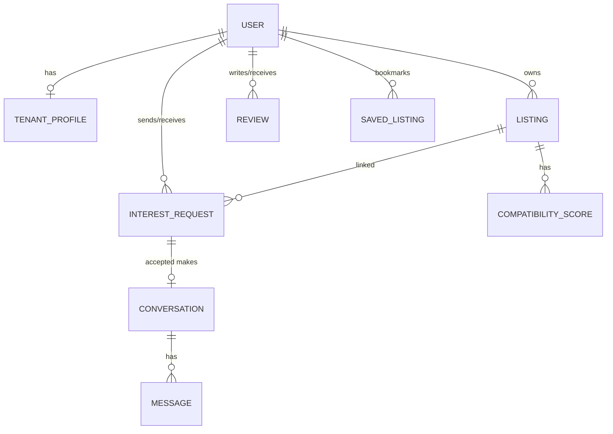
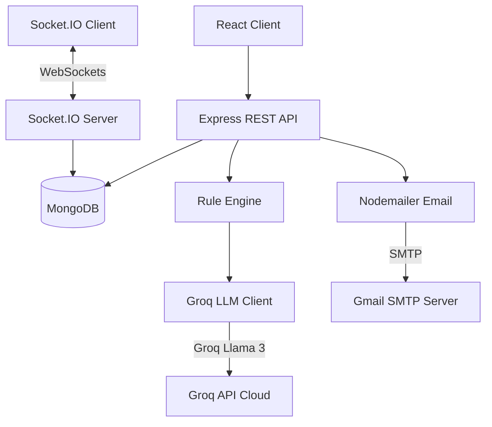

# System Design Write-up — Rent & Flatmate Finder 🏠🤖

This write-up covers the core architecture, AI compatibility engine, chat systems, and notification workflows for the Rent & Flatmate Finder platform.

---

## 1. Hybrid Compatibility Scoring Design
The system uses a **two-phase hybrid scoring engine** to rank listings for tenants efficiently:
1. **Stage 1 (Rule Scorer)**: Evaluates all candidate listings locally. It computes geospatial distance via the Haversine formula (max 30 points) and checks budget, availability, room type, furnishing, and description keyword filters (max 70 points). The top 5 listings are passed to Stage 2.
2. **Stage 2 (LLM Scorer)**: Invokes semantic analysis via Groq API only for the Top-5 listings to minimize cost and latency.

### Geospatial Calculations & Bands
Given coordinates $(lat_1, lng_1)$ for listing and $(lat_2, lng_2)$ for preferred location, the Haversine distance $d$ in km is calculated:
$$\Delta lat = lat_2 - lat_1, \quad \Delta lng = lng_2 - lng_1$$
$$a = \sin^2\left(\frac{\Delta lat}{2}\right) + \cos(lat_1) \cdot \cos(lat_2) \cdot \sin^2\left(\frac{\Delta lng}{2}\right)$$
$$d = 2R \cdot \arcsin(\sqrt{a}) \quad (R = 6371\text{ km})$$

Location score bands:
* $d \le 1.0\text{ km}$: 30 pts | $d \le 3.0\text{ km}$: 28 pts | $d \le 5.0\text{ km}$: 24 pts | $d \le 8.0\text{ km}$: 20 pts | $d \le 12.0\text{ km}$: 15 pts | $d \le 20.0\text{ km}$: 8 pts | $d > 20.0\text{ km}$: 0 pts.

### Score Aggregation & Caching
For the Top-5 candidates, rule-based and LLM scores are combined:
$$\text{Score}_{\text{final}} = \text{round}\left(0.3 \cdot \text{Score}_{\text{rule}} + 0.7 \cdot \text{Score}_{\text{LLM}}\right)$$
To optimize performance, scores are cached in the `CompatibilityScore` collection with a snapshot of listing/tenant inputs. If inputs remain unchanged, the cached score is reused; any profile or listing update invalidates the cache.

---

## 2. LLM Integration and Fallback Mechanism
The `groqService.js` client connects to the Groq Cloud API using the `llama-3.3-70b-versatile` model. To ensure reliability:
1. **LLM Query**: Sends listing specs and tenant preferences, requesting a strict JSON response.
2. **Graceful Fallback**: If the Groq API times out, encounters a rate limit (HTTP 429), or outputs invalid JSON, the system catches the exception and falls back 100% to the local Rule Engine score.
3. **Discount Factor**: A **0.7 discount multiplier** is applied to fallback scores (e.g. $80 \times 0.7 = 56$). This ensures that listings verified by the AI rank higher than non-AI fallbacks in the listings feed.
4. **Audit Trail**: Fallback entries are marked with `generatedBy: "rule-engine"` for auditing.

---

## 3. Access-Controlled Chat Architecture
To prevent spam, tenants and landlords can only converse if the landlord accepts the tenant's interest request.
* **Access Control Assertion**: Every message retrieval or chat mount endpoint (`GET /api/messages/conversation/:id`) queries the database to verify that an `InterestRequest` exists between the listing, tenant, and landlord with `status: "accepted"`. Unauthorized requests return an HTTP 403.
* **WebSocket Authentication**: The Socket.IO middleware verifies a JWT passed during handshake (`socket.handshake.auth.token`).
* **Durability**: Messages sent via Socket.IO are written to MongoDB (`Message.create`) before being broadcasted, preventing message loss.

---

## 4. Notification Flow
Events trigger automated emails via Nodemailer:
1. **High Compatibility Match**: When a tenant submits an interest request (`POST /api/interest`) and the compatibility score exceeds the `HIGH_COMPATIBILITY_THRESHOLD` (default 80), the landlord receives an email alerting them of a premium match.
2. **Status Updates**: Landlord approval/rejection (`PUT /api/interest/:id`) dispatches a status update email to the tenant.
3. **Fault Isolation**: Email dispatch runs inside try/catch blocks; SMTP failures are logged, but do not block core API database transactions.

---

## 5. ER Diagram

---

## 6. System Architecture Diagram

